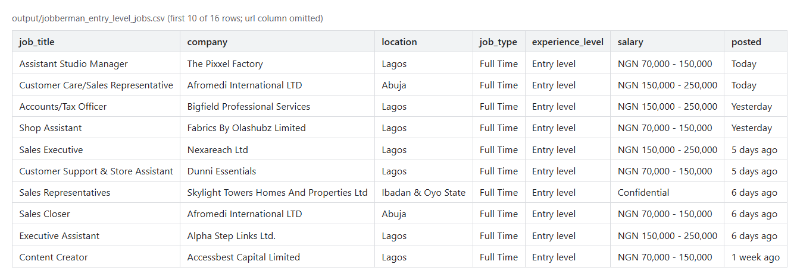

# lordgen-scraper

A schema-first web-scraping workflow: Claude Code drives Firecrawl to turn company
sites and job boards into spreadsheet-ready CSV. For anyone who needs a few clean
datasets from the web without writing and maintaining a scraper per site.

Built by **[Lordmark Dorgu](https://github.com/Kikobazz123)** · MIT licensed (the
workflow and docs; see [Data](#data) for the scraped files).



---

## The problem it solves

Lead research and job-market checks kept needing small, structured datasets from
sites with no API: a supplier's services and contacts, the entry-level listings on a
job board. Writing a scraper for each is slow and breaks when the markup changes;
free-form "summarise this page" output gives different columns every run. This repo
is the middle path: a hosted scraping engine plus a fixed schema per record type,
so the columns are known before the scrape starts.

## Stack

[Firecrawl](https://firecrawl.dev) (scrape, crawl, map, structured JSON extraction) ·
Claude Code with the Firecrawl MCP server · Firecrawl REST API and `firecrawl-cli`
as fallbacks · CSV / Markdown output

There is no application code in this repository. The "program" is the set of
conventions in [`CLAUDE.md`](CLAUDE.md) that the agent follows, plus the vendored
Firecrawl skill.

## Architecture

```
request ("pull the entry-level jobs from Jobberman")
   -> define a JSON schema for the record type        (columns fixed up front)
   -> Firecrawl scrape / crawl with that schema       (MCP, else REST, else CLI)
   -> flag placeholder or template content            (not treated as real data)
   -> write output/<source>_<record>.csv              (or .md for raw dumps)
```

```
CLAUDE.md                          conventions the agent follows
.claude/skills/firecrawl/          Firecrawl's own skill and cheatsheet (vendored)
output/                            example datasets produced by the workflow
.env.example                       FIRECRAWL_API_KEY
```

## Run locally

1. Get a Firecrawl API key and copy `.env.example` to `.env`.
2. Open the folder in Claude Code. With the Firecrawl MCP server connected it is
   used directly; otherwise the agent falls back to the REST API with
   `FIRECRAWL_API_KEY`, or to `npx firecrawl-cli`.
3. Ask for a dataset. The agent proposes the schema first, then scrapes into
   `output/`.

## Tests

None. There is no code to unit-test; output quality is checked by reading the
files.

## Design decisions and trade-offs

- **Schema before scrape.** Every structured extraction declares its fields first.
  It costs a minute per record type and buys predictable columns, which matters
  more than coverage when the destination is a spreadsheet.
- **Right format per destination.** CSV for anything that will be imported;
  Markdown for a raw content dump that a person will read. Converting a page of
  prose into rows loses more than it gains.
- **Hosted engine over hand-written scrapers.** Firecrawl handles rendering and
  markup changes; the trade-off is an API key, usage limits and a dependency on its service.
- **Suspicious content is flagged, not trusted.** Placeholder text or stock data on
  a real business's site is reported as such rather than passed downstream as fact.

## Data

`output/` holds small example datasets: one company profile and its services, 16
entry-level job listings (CSV and XLSX), and one raw Markdown page dump. They are
public business information scraped from third-party sites, included to show the
output format; the MIT licence covers this repo's own work, not that data. The
`posted` column in the job listings is relative ("Today", "5 days ago") and was only
true on the day of the scrape.
